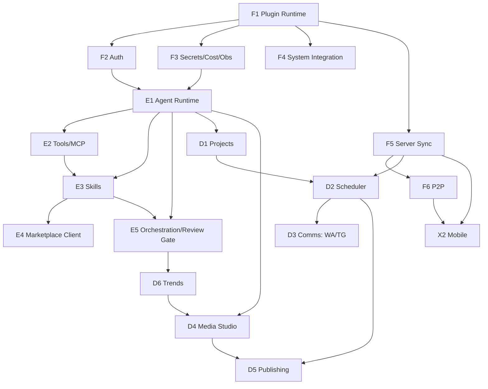

# Maestro — Vision & Ecosystem Decomposition

> **Working codename:** "Maestro" (placeholder — you conduct a fleet of agents + a creative studio). Alternatives to consider later: *Helm, Foundry, Atlas, Loom, Polymath, Forge*. Rename anytime.
>
> **Document status:** Foundation draft for gut-check. Written from your brief, independent of the live web-research workflow (`wf_07dcf9ad-093`). The research will harden the *technical/vendor* choices in the follow-on PRD + Architecture docs.
>
> **Date:** 2026-06-09 · **Scope confirmed:** single-user · max capability · full enterprise-grade build · all subsystems in parallel.

---

## 1. North Star

> **A single-operator "operating system for AI work": one desktop app from which you command a fleet of AI coding/creative agents — across many projects, on schedules, over chat, and from your phone — that can pull in any skill on demand and produce anything from a shipped codebase to a trend-researched, auto-published video.**

You are the only user, but you wear many hats (developer, designer, content creator, operator). Maestro gives each hat a "project type" and lets you run dozens of jobs in parallel without babysitting them.

### Success looks like
- Spin up a project, hand it a goal, walk away — it plans, executes, reviews itself (Claude builds, GPT reviews), and pings you only at decision gates.
- Say "research this genre and produce + publish 3 videos this week" → it does trend research, generates video, and uploads everywhere on a schedule.
- It finds a capability it doesn't have, searches your skills marketplace, downloads the right skill, and uses it — without you wiring anything.
- You approve a gate from WhatsApp or your phone on the train; the machine at home never sleeps mid-job.

---

## 2. Operating Principles (design tenets)

1. **Provider-agnostic engine.** Claude Code/Agent SDK is the primary brain; GPT-class is the review brain; the abstraction lets either role swap models. Effort is a dial, not a rebuild.
2. **Everything is a plugin.** The core is a thin runtime; every capability (an engine, a connector, a studio tool, a publisher) is a module loaded over a stable contract. Add features on the fly.
3. **Capabilities are dynamic.** Skills and tools are *discovered and loaded per job*, not baked in. The marketplace is a first-class dependency source, like npm for agent skills.
4. **Projects are typed.** "Claude", "Claude-Design", "Claude-Code" etc. are *project templates* (preset engine + skills + tools + instructions + UI), so the same core serves many purposes.
5. **Single-user, max trust, hard security on secrets.** No multi-tenancy tax — but API keys/OAuth tokens live in the OS keychain, jobs run with scoped permissions, and third-party skills/tools are sandboxed.
6. **Always-on, observable, governed.** Jobs don't die because the Mac slept. Every token, dollar, and action is tracked, capped, and auditable.
7. **Reach you anywhere.** Same control surface on desktop, phone, and chat (WhatsApp/Telegram), synced — direct P2P when possible, relay when not.
8. **Plan before power.** Plan mode + human-in-the-loop gates by default for risky work; full autonomy when you opt in.

---

## 3. Requirements Inventory (from your brief)

MoSCoW: **M**ust / **S**hould / **C**ould. All are in-scope eventually given "build everything"; MoSCoW marks the dependency/criticality ordering, not exclusion.

### 3.1 Agent engine & models
| # | Requirement | Pri |
|---|---|---|
| AE‑1 | Claude Code / Claude Agent SDK as **primary** engine | M |
| AE‑2 | GPT‑5.x‑class as **review model** (reviews/critiques the primary's work) | M |
| AE‑3 | **Native OAuth** for both providers (sign-in, not just API keys) | M |
| AE‑4 | **Switchable reasoning effort** per job/session (and review depth) | M |
| AE‑5 | Plan mode, permission modes, hooks, subagents, sessions, streaming | M |
| AE‑6 | Provider-agnostic so models/roles can swap | S |

### 3.2 Projects, jobs & scheduling
| # | Requirement | Pri |
|---|---|---|
| PJ‑1 | **Projects + sub-projects**, general-purpose, template-driven (Claude / Claude-Design / Claude-Code…) | M |
| PJ‑2 | **Per-project instructions/config** that scope every job in that project | M |
| PJ‑3 | **Scheduler** for one-off + recurring jobs, "as many as I want" | M |
| PJ‑4 | Per-project scheduling, concurrency, retries, missed-run handling | M |
| PJ‑5 | Triggers: manual, schedule, comms message, webhook/event | S |

### 3.3 Dynamic skills + marketplace
| # | Requirement | Pri |
|---|---|---|
| SK‑1 | **Per-job separated skills** (each job gets exactly the skills it needs) | M |
| SK‑2 | **Online skills marketplace** I can publish unlimited skills to | M |
| SK‑3 | App **searches** the marketplace for an appropriate skill when needed | M |
| SK‑4 | On finding one, **downloads + loads it for that job's session** | M |
| SK‑5 | Versioning, updates, sandboxing, trust of downloaded skills | S |
| SK‑6 | Scoped **MCP servers/tools** attachable per project/job | S |

### 3.4 Comms connectors
| # | Requirement | Pri |
|---|---|---|
| CM‑1 | **Native WhatsApp** integration (send/receive, trigger + report jobs) | M |
| CM‑2 | **Native Telegram** integration (same) | M |
| CM‑3 | Pluggable connector contract (Slack/Discord/email later) | C |

### 3.5 Server, mobile & P2P
| # | Requirement | Pri |
|---|---|---|
| MB‑1 | **Self-hosted server** backing a **mobile app** | M |
| MB‑2 | See/control "everything" from mobile (jobs, gates, media, chat) | M |
| MB‑3 | **Peer-to-peer** connection when possible (relay fallback) | S |
| MB‑4 | Push notifications + remote approvals | S |

### 3.6 Creative media studio
| # | Requirement | Pri |
|---|---|---|
| MS‑1 | **Image generation** support | M |
| MS‑2 | **Video generation** — every modern real-world feature | M |
| MS‑3 | **Avatar videos** (talking-head) | M |
| MS‑4 | **Kinetic typography / HTML-driven motion graphics** | M |
| MS‑5 | Voice/TTS, music, captions, b-roll, timeline/compositor | S |
| MS‑6 | "As easy as possible" authoring UX | M |

### 3.7 Distribution & intelligence
| # | Requirement | Pri |
|---|---|---|
| DI‑1 | **Auto-publish to every platform possible** (YouTube/TikTok/IG/…) | M |
| DI‑2 | **Genre/trend research** feeding super-quality video on a given genre | M |
| DI‑3 | Hook/title/thumbnail/posting-time optimization | S |

### 3.8 Platform & UX
| # | Requirement | Pri |
|---|---|---|
| PF‑1 | **Modular** architecture; add features on the fly | M |
| PF‑2 | **Prevent system sleep** while an agent/job is running | M |
| PF‑3 | Desktop command center UI (projects, jobs, studio, marketplace, chat) | M |
| PF‑4 | Leverage existing **Super‑Tester** browser-extension capabilities | S |

### 3.9 Non-functional
- **Reliability:** jobs survive sleep, app restarts, and network blips (durable queue + resumable agent sessions).
- **Security:** OS-keychain secrets; sandboxed skills/tools; scoped permissions; signed plugins.
- **Cost governance:** per-provider/per-project/per-job token + $ tracking, budgets, hard caps.
- **Observability:** structured logs, traces, run history, replayable transcripts.
- **Performance:** many concurrent jobs without UI jank; streaming everywhere.
- **Extensibility:** stable plugin SDK; new module added without touching the core.
- **Portability:** macOS first (your env), Windows/Linux feasible via the chosen framework.

---

## 4. The Mental Model

```
Workspace
└── Project            (typed: Code / Design / Content / Research / …)   ← per-project instructions + defaults
    ├── Sub-project    (a focused stream inside a project)
    └── Job            (a unit of work: one-off or scheduled, with a trigger)
        └── Session    (a live agent run: engine + effort + permissions)
            ├── Skills (loaded on demand from marketplace, per session)
            ├── Tools  (scoped MCP servers/tools)
            └── Workflow (optional multi-agent orchestration: plan→build→review)
```

A **Project Template** is a saved preset of: default engine + review model + effort, starter skills/tools, instruction set, UI layout, and allowed triggers. "Claude", "Claude-Design", "Claude-Code" are just three templates. New templates are user-creatable — that's what makes Maestro general-purpose.

---

## 5. Ecosystem Decomposition — Modules in 4 Layers

Each module: **what it does · public interface · depends on**. Everything above the Foundation layer is a plugin over the runtime.

### Layer 0 — Foundation (the thin core)
| Module | What it does | Depends on |
|---|---|---|
| **F1 Plugin Runtime / Kernel** | Loads modules over a stable contract; lifecycle, IPC, event bus; the "add features on the fly" backbone | — |
| **F2 Identity & Auth** | Native OAuth (Anthropic, OpenAI, social platforms, comms); token storage in OS keychain; refresh | F1 |
| **F3 Secrets & Cost/Observability** | Secrets vault; per-provider/job token+$ metering; budgets/caps; logs, traces, run history | F1 |
| **F4 System Integration** | Prevent-sleep/wake-lock during jobs; tray, native notifications, deep links, auto-update | F1 |
| **F5 Sync Backbone (server)** | Self-hosted server: event bus, state store, CRDT sync, push fan-out, secure pairing | F1 |
| **F6 P2P Layer** | Direct device↔device (WebRTC/libp2p) with relay fallback; encrypted channels | F5 |

### Layer 1 — Engine (the brains & capabilities)
| Module | What it does | Depends on |
|---|---|---|
| **E1 Agent Runtime / Engine Abstraction** | Provider-agnostic interface over Claude Agent SDK (primary) + Codex/OpenAI (review); effort, plan mode, permissions, sessions, hooks, streaming | F2,F3 |
| **E2 MCP / Tools Manager** | Discover + attach scoped MCP servers/tools per project/job; sandbox | F1,F3 |
| **E3 Skills Subsystem** | Local skill registry; semantic match "which skill for this job"; load/unload per session; sandbox + versioning | E1,E2 |
| **E4 Marketplace Client** | Talks to the online skills marketplace: search, publish (unlimited), download, update; trust/signing | E3,F2 |
| **E5 Orchestration / Workflow Engine** | Multi-agent workflows (fan-out, pipeline, verify); **plan→build→review gate** (GPT reviews Claude); human-in-the-loop checkpoints | E1,E3 |

### Layer 2 — Domain (what you actually do)
| Module | What it does | Depends on |
|---|---|---|
| **D1 Project & Workspace Manager** | Projects/sub-projects, templates, per-project instructions, git worktree isolation, environments | E1 |
| **D2 Job & Scheduler Engine** | One-off + cron jobs, durable queue, concurrency, retries, missed-run recovery, triggers | D1,F5 |
| **D3 Comms Connectors** | WhatsApp + Telegram (pluggable): inbound triggers, outbound reports, remote approvals | F5,D2 |
| **D4 Media Studio** | Image gen · video gen (text/img-to-video) · avatar/talking-head · kinetic typography (Remotion/HTML) · TTS/voice · music · captions · timeline/compositor · render pipeline | E1,F3 |
| **D5 Publishing & Distribution** | Multi-platform upload (YouTube/TikTok/IG/X/…), scheduling, metadata/SEO | D2,F2 |
| **D6 Trend & Research Intelligence** | Genre/trend research, hook/title/thumbnail optimization; content briefs feeding D4 | E5 |

### Layer 3 — Experience
| Module | What it does | Depends on |
|---|---|---|
| **X1 Desktop Shell** | Command center: projects, job monitor, studio, marketplace browser, chat/timeline; effort & plan controls | all |
| **X2 Mobile App** | Monitor/drive jobs, approve gates, view/share media, notifications — over F5/F6 | F5,F6 |
| **X3 Browser bridge (Super‑Tester)** | Reuse the existing extension's capabilities as an agent tool surface | E2 |

---

## 6. Dependency Graph (critical path)



**Critical path (must exist before much else works):** `F1 → F2/F3 → E1 → D1 → D2`. The agent engine + projects + scheduler is the spine; everything else hangs off it. The **marketplace + skills loop** (E3→E4) and the **media studio** (D4→D5/D6) are the two big independent workstreams that can be built in parallel once E1 exists.

---

## 7. The Dynamic-Skill Loop (the heart of "skill-heavy")

```
Job needs capability X
   → E3 checks local registry      (have it? load it, done)
   → else E4 searches Marketplace  (semantic query from job intent)
   → ranks candidates, picks best  (trust + version + relevance)
   → downloads + verifies signature
   → loads into THIS session only   (scoped, sandboxed)
   → agent uses it; on job end → unload / cache per policy
```

This is what makes Maestro "as dynamic skill-heavy as possible": the agent's capabilities expand at runtime from your marketplace, per job, automatically.

---

## 8. The Review-Model Loop (Claude builds, GPT reviews)

```
Plan (Claude, effort=X)  →  Build (Claude)  →  Review (GPT‑5.x, effort=Y)
                                   ↑                     │ findings
                                   └──── fix loop ◄──────┘  (until clean or gate)
                                                          → human gate (desktop/mobile/WhatsApp)
```

Effort is independently switchable for the build pass and the review pass.

---

## 9. Build Approach — Parallel Workstreams

You chose "build everything in parallel." Solo, that means **parallel workstreams sharing one critical path**, not literally-everything-at-once. Proposed workstreams (each its own spec→plan→build cycle):

1. **Spine** (blocks most): F1 Runtime → F2 Auth → F3 Obs → E1 Agent Runtime → D1 Projects → D2 Scheduler.
2. **Capability** (parallel after E1): E2 Tools → E3 Skills → E4 Marketplace (+ the marketplace *backend* as its own service).
3. **Orchestration** (parallel after E1/E3): E5 workflows + Claude-builds/GPT-reviews gate.
4. **Reach** (parallel after F5): F5 Server → F6 P2P → X2 Mobile → D3 Comms (WhatsApp/Telegram).
5. **Studio** (fully parallel, only needs E1): D4 Media Studio → D6 Trends → D5 Publishing.
6. **Shell** (continuous): X1 Desktop UI grows alongside everything.

> Recommendation even under "full build": ship the **Spine + a single end-to-end vertical** (one project type running a scheduled job that loads one marketplace skill, visible on desktop) as the first integration milestone — it de-risks every interface before the parallel teams pour concrete. We can still staff all workstreams at once.

---

## 10. Open Questions (deferred to research + PRD)

- **Desktop framework:** Tauri v2 vs Electron (bundling Node SDKs, perf, sleep-blocking). → research E `desktop-app-architecture`.
- **Mobile:** React Native vs Flutter vs native. → research `mobile-server-p2p-sync`.
- **WhatsApp:** official Cloud API vs Baileys/Evolution (capability vs ban-risk). → research `whatsapp-integration`.
- **Video vendors:** Sora 2 / Veo 3 / Kling / Runway / fal.ai aggregation — which to wrap first. → research `ai-video-generation`.
- **Skill format & marketplace protocol:** adopt Claude Agent Skills (SKILL.md) + a registry API? signing/trust model?
- **Where the marketplace lives:** is it a separate hosted service you operate (publish endpoint + search index)?
- **Codex/GPT review auth:** OAuth (ChatGPT sign-in) vs API key for the review model.

These resolve in **`docs/agentos/PRD.md`** (master PRD) and **`docs/agentos/ARCHITECTURE.md`**, authored once the research workflow lands.
